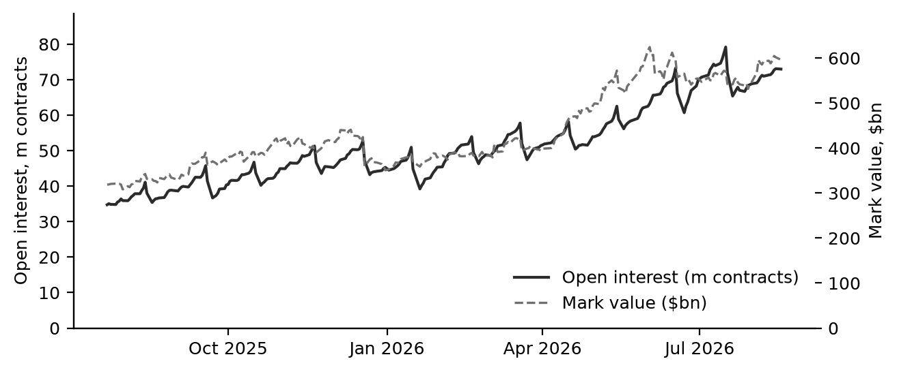
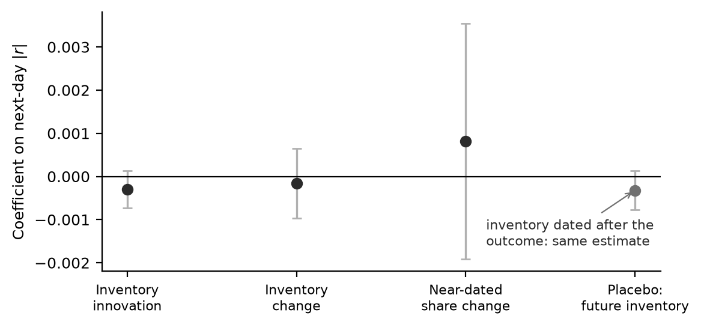

# The Hidden Options Market

**FLEX inventory in clearing data, and whether it predicts the visible market.**

FLEX options are negotiated bilaterally, cleared centrally, and absent from the listed
option chains that most option research is built on. They are not unobservable. The
Options Clearing Corporation publishes a free daily report of every cleared FLEX series —
root, strike, expiry, mark price and open interest — and this repository turns it into a
panel.



| | 23 Jul 2025 | 17 Aug 2026 |
|---|---:|---:|
| Open interest | 34.8m contracts | **73.0m contracts** |
| Mark value | \$319bn | **\$596bn** |

269 activity dates, 1,691 underlyings, 9.06m series-days. On the last date, 42,740 series
across 1,023 underlyings: the ten largest underlyings hold 29% of open interest, 56%
expires within sixty days, and 57% is calls.

## Does hidden inventory predict the visible market?

A dealer on the other side of a FLEX trade hedges it in the listed market and carries the
residual convexity while the position lives. If that matters, inventory published
overnight for day *T* should say something about day *T+1*.

It does not. Underlying and date fixed effects, errors two-way clustered, controls for
trailing realised volatility at 5 and 22 days, same-day absolute return and log dollar
volume; 58,014 underlying-days across 281 underlyings.

| predictor | outcome | β | *t* | MDE80 |
|---|---|---:|---:|---:|
| inventory innovation | next-day \|r\| | −0.00030 | −1.37 | 0.00062 |
| inventory change | next-day \|r\| | −0.00016 | −0.40 | 0.00115 |
| near-dated share change | next-day \|r\| | +0.00081 | +0.58 | 0.00390 |
| put share | next-day \|r\| | −0.00189 | −1.73 | 0.00307 |
| inventory innovation | next-day r² | −0.00003 | −0.81 | 0.00011 |
| **placebo: inventory dated *after* the outcome** | next-day \|r\| | **−0.00032** | **−1.37** | 0.00065 |



The placebo cannot carry information, and on this sample it reproduces the genuine
estimate to two decimal places. On an earlier, smaller panel the same predictor reached
*t* = −1.95 — the kind of number that gets written up as suggestive when no placebo is
run. The minimum detectable effect at 80% power is about 0.0006 against a typical daily
|r| near 0.02, so effects of 3–5% would have shown up. Longer horizons are weaker still.

**The null does not depend on the window.** Loading the panel from different start dates
changes the estimates, but no predictor reaches |*t*| = 2 on any of them:

| panel loaded from | underlying-days | inventory innovation | placebo |
|---|---:|---:|---:|
| 2025-09-09 (table above) | 58,014 | −0.00030 (*t* −1.37) | −0.00032 (*t* −1.37) |
| 2025-07-23 | 65,356 | −0.00039 (*t* −1.86) | −0.00032 (*t* −1.48) |
| 2024-12-02 (all on disk) | 99,097 | −0.00026 (*t* −1.29) | +0.00004 (*t* +0.26) |

The exact placebo match is specific to the first sample; the absence of predictability is
not.

Not ruled out: strike-local effects, intraday responses, and effects on the listed option
surface rather than the underlying. Each needs data that cannot be collected
retrospectively for free. Details in [`docs/PREDICTIVE_RESULT.md`](docs/PREDICTIVE_RESULT.md).

## Two measurement results that travel

**FLEX cannot be found by its strikes.** Listed strikes sit on a grid, so an off-grid
strike looks like a FLEX tell. Scored against the OCC report over 486,895 cleared series,
that rule has precision 0.67 and recall 0.34. FLEX is routinely struck *on* the grid —
`1AAON` at \$99.00 is FLEX — so two thirds of it is invisible to any strike-based test,
and a third of what the rule flags is not FLEX at all. This project used the rule first;
the superseded census is kept as it was in [`docs/FLEX_CENSUS.md`](docs/FLEX_CENSUS.md).

**A cleared series is not a position.** Open interest is reported per series, and
positions span series. Conflating them produced errors in both directions that do not
cancel:

- a butterfly counted leg by leg is credited with **49×** its maximum attainable value;
- a four-leg SPY collar is counted about **3×** over;
- a synthetic long call struck at \$1.87 against a \$765 spot is recorded as **\$7m** of
  strike notional when its exposure is **\$2.9bn**.

## Run it

Python 3.11+. Every input is free: no WRDS, no OptionMetrics, no vendor feed, no account.

```bash
uv venv && uv pip install -e '.[dev]'
.venv/bin/pytest                                     # 283 tests

# the OCC FLEX report, equity and index classes
.venv/bin/python scripts/backfill_occ_flex.py --start 2025-07-23 --end 2026-08-17

# the regression table above
.venv/bin/python scripts/run_predictive.py --start 2025-09-09 --end 2026-08-17

# the figures in this README
.venv/bin/python scripts/make_readme_figures.py
```

Every downloaded report is checked against the per-class totals it carries and stored
under its own activity date, not the date it was fetched. OCC publishes overnight, so a
capture taken during a session returns the previous settlement; partitioning by fetch
date would enter one settlement twice as two suspiciously stable days.
`run_predictive.py` joins the panel to daily bars for the underlyings
(`data/flex_underlying_bars.parquet`, fetched with `absorb.collect.bars.fetch_bars`).

## Layout

```
src/absorb/collect/occ_flex.py      OCC FLEX report: fetch, parse, validate
src/absorb/measure/flex_panel.py    panel assembly and inventory measures
src/absorb/measure/structures.py    leg grouping and valuation on the underlying
src/absorb/collect/                 chains, holdings, bars and N-PORT collectors
scripts/                            backfill, regressions, figures
docs/                               results and corrections, as they happened
```

The earlier strike-heuristic census is rebuilt by `scripts/reproduce.sh`. Raw snapshots
from the collectors are vendor-sourced and not redistributed here; the scheduled capture
is described in [`docs/OPERATIONS.md`](docs/OPERATIONS.md).

## License

MIT for the code.
